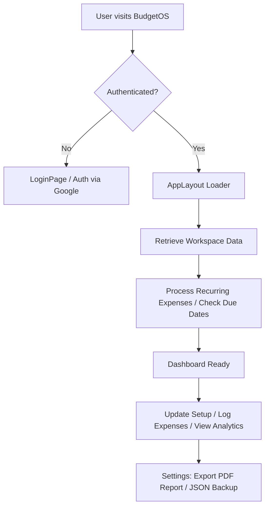

# 💼 BudgetOS

> A premium, client-first, and fully responsive personal budgeting OS designed with a bold, clean aesthetic. Built for modern financial clarity.

[](https://budget-os-teal.vercel.app/)
[](#-tech-stack)
[](#-database-schema)
[](#)

🌐 **Live Website Link**: [https://budget-os-teal.vercel.app/](https://budget-os-teal.vercel.app/)

---

## 📖 Table of Contents
1. [🚀 Overview](#-overview)
2. [🛠 Tech Stack](#-tech-stack)
3. [✨ Features](#-features)
4. [🛠 How It Works](#-how-it-works)
5. [🗄 Database Schema](#-database-schema)
6. [📦 Getting Started](#-getting-started)
7. [☁️ Vercel Deployment](#️-vercel-deployment)

---

## 🚀 Overview

**BudgetOS** is a modern personal finance application styled with a minimalist, high-contrast, card-based interface (reminiscent of premium utilities like Notion and modern banking applications). 

Unlike heavy, complex accounting software, BudgetOS focuses strictly on **allowance-based monthly budgeting**. It automates standard commitments, tracks category spending in real-time, displays visual analytics, and generates production-quality financial report cards directly in the browser.

---

## 🛠 Tech Stack

The application is built entirely on a light, modular, and fast modern web stack:

*   **Frontend Library**: [React 19](https://react.dev/) + [Vite](https://vite.dev/) (for lightning-fast builds & hot module reloading).
*   **Database & Auth**: [Supabase JS Client](https://supabase.com/) (realtime synchronization, session authentication, and PostgreSQL storage).
*   **Styling**: Vanilla CSS with **CSS Modules** (for localized style scope, smooth transitions, and premium responsive layouts).
*   **Visualizations**: [Recharts](https://recharts.org/) (responsive bar, pie, and line charts rendering SVG metrics).
*   **PDF Generation**: [jsPDF](https://github.com/parallax/jsPDF) + [html2canvas](https://html2canvas.hertzen.com/) (on-the-fly rendering and multi-page A4 compiling with zero server dependencies).
*   **Icons**: [Lucide React](https://lucide.dev/) (clean, consistent layout iconography).

---

## ✨ Features

### 📈 Real-Time Dashboard
*   **Allowance Tracker**: Compare total monthly income against recorded expenses in real-time.
*   **Interactive Expense Logging**: Add, edit, or delete transactions instantly with category tags, notes, and payment methods.
*   **Quick Metrics**: View your average expense size, remaining budget, and monthly savings goal progress at a single glance.

### 📅 Monthly Setup
*   **Category Allocation**: Configure budgets for distinct categories (e.g., Food, Travel, Rent) with customizable names, limits, and color tags.
*   **Auto-Calculations**: Track allocation totals against your allowance to prevent over-budget scheduling before the month starts.

### 🔄 Recurring Expenses (Automated Bills)
*   **Commitment Templates**: Define subscriptions, rent bills, or insurance premiums with frequencies (daily, weekly, bi-weekly, monthly, yearly), next due dates, and end dates.
*   **On-Load Synchronization**: On workspace load, the system checks for due recurring expenses, automatically logs them to the ledger, and advances the next due date.

### 📊 Visual Analytics
*   **Category Mix**: A clean doughnut chart displaying your spending distribution.
*   **Budget vs. Actual**: Interactive comparison of category limits against real-world spending.
*   **Trend Tracking**: A line chart mapping your historical spent vs. saved totals over the last 6 months.

### 📄 Professional PDF Export
*   **Premium Layout**: Renders an executive A4-sized financial report including covers, overview, category summaries, Recharts visualizations, ledger details, and recurring commitments.
*   **Smart Insights**: Dynamically evaluates your monthly performance, flags over-budget categories, and suggests smart savings improvements.

### 📱 100% Mobile-First Responsive Design
*   **Flexible Navigation**: Left sidebar navigation on desktops collapses into a floating, safe-area-friendly bottom navigation bar on mobile.
*   **Stacked Card Tables**: Ledger tables convert from wide tabular grids on desktop to structured, individual card details on mobile screens, avoiding uncomfortable horizontal scrolling.

---

## 🛠 How It Works



1.  **Authentication**: Users sign in via Google OAuth powered by Supabase.
2.  **State Synchronization**: The app retrieves the user's active monthly profile, settings, category limits, expenses, and recurring templates.
3.  **Bill Processing**: The system evaluates active recurring templates. If a template's `next_due_date` is in the past, it logs the transaction into `expenses` and increments the due date using modular date interval algorithms.
4.  **Budgets**: Calculations occur client-side in real-time based on the database records.
5.  **PDF Reports**: Custom CSS styling sets up off-screen canvas pages. `html2canvas` captures them as pixel-perfect images, and `jsPDF` structures them into a paginated document.

---

## 🗄 Database Schema

The system uses Supabase PostgreSQL. Tables match the production schema defined in `BUDGETOS_sql.pdf`:

*   **`profiles`**: Links users to active workspace months, default allowances, and savings goals.
*   **`monthly_budgets`**: Individual entries for every month tracked.
*   **`monthly_budget_categories`**: Allocations for category limits, names, icons, and colors.
*   **`expenses`**: Raw transaction ledger.
*   **`recurring_expenses`**: Scheduled payment templates with due dates and cycle intervals.
*   **`settings`**: User workspace configurations (currency, theme, defaults, notifications).

---

## 📦 Getting Started

### Prerequisites
*   Node.js (v18 or higher)
*   Supabase Account

### Installation

1.  Clone the repository:
    ```bash
    git clone https://github.com/ayush21-r/budget-os.git
    cd budget-os
    ```

2.  Install dependencies:
    ```bash
    npm install
    ```

3.  Configure local environment variables:
    Create a `.env` file in the root directory:
    ```env
    VITE_SUPABASE_URL=https://your-supabase-project.supabase.co
    VITE_SUPABASE_ANON_KEY=your-anonymous-api-key
    ```

4.  Start local development server:
    ```bash
    npm run dev
    ```

---

## ☁️ Vercel Deployment

BudgetOS is configured for quick deployment on Vercel. 

### Deploying from Git:
1. Import your repository into the Vercel Dashboard.
2. Under **Build and Output Settings**, select the **Vite** preset (Vercel automatically sets Build Command to `npm run build` and Output Directory to `dist`).
3. Add your environment variables:
   * `VITE_SUPABASE_URL`
   * `VITE_SUPABASE_ANON_KEY`
4. Deploy! Rewrites are handled natively via the bundled [vercel.json](file:///c:/Project/BudgetOS/vercel.json) configuration to prevent router refresh conflicts.
